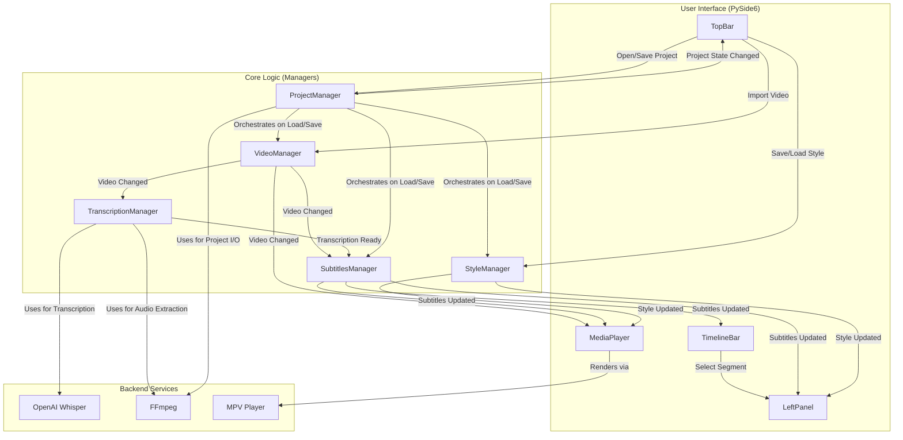

# Auto Subs: Architecture Overview

This document provides a high-level overview of the technical architecture of the Auto Subs application. Its purpose is to help developers and contributors understand the system's design, its core components, and the rationale behind key technical decisions.

## 1. High-Level Overview

Auto Subs is a desktop application built with Python and PySide6. Its architecture can be described as **Manager-based and Event-Driven**.

-   **Manager-based:** The application's state and core business logic are encapsulated within a set of distinct `Manager` classes. Each manager is responsible for a specific domain (e.g., subtitles, styling, project state). This centralizes state and decouples logic from the UI.
-   **Event-Driven:** Components communicate using a **listener (observer) pattern**. When a manager's state changes, it notifies all its registered listeners (typically other managers or UI components), which then react accordingly. This promotes loose coupling and a unidirectional data flow.

Long-running operations, such as AI-powered transcription and project I/O, are handled asynchronously to ensure the user interface remains responsive at all times.

### System Diagram

## 2. Component Breakdown

### Managers (`src/managers/`)

Managers are the brain of the application. They hold state and implement business logic, but they have no direct knowledge of the UI widgets.

-   **`ProjectManager`**: Manages the lifecycle of a project (`.asproj` files). It orchestrates saving and loading by interacting with the `VideoManager`, `SubtitlesManager`, and `StyleManager`. It is responsible for all project-related file I/O, including zipping/unzipping the project archive. It notifies the UI when a project is opened, saved, or closed.
-   **`VideoManager`**: Manages the currently loaded video file. Its sole responsibility is to hold the video path and its duration. It notifies listeners when a new video is imported.
-   **`TranscriptionManager`**: Handles the entire speech-to-text process. It loads the Whisper model in a background thread and exposes an `async` method to transcribe an audio file. When transcription is complete, it notifies its listeners with the raw result.
-   **`SubtitlesManager`**: Acts as the central store for subtitle data. It listens to the `TranscriptionManager` and processes the raw transcription into structured `Subtitles` models. It provides methods to manipulate this data (edit, delete, merge) and notifies the UI whenever the subtitles change.
-   **`StyleManager`**: Manages the visual styling of subtitles. It holds the current style properties (font, color, size, etc.), handles saving/loading style presets, and notifies listeners when the style is modified so the video preview can be updated.

### UI Layer (`src/ui/`)

The UI is built with PySide6 (Qt) and is responsible for presentation and user interaction. It is designed to be a "dumb" layer that primarily reacts to events from the managers.

-   **`SubtitleEditorApp`**: The main application window that initializes all managers and UI components and wires them together. It listens to manager events to update global state like the window title or show dialog boxes.
-   **`LeftPanel`**: A dynamic context-aware panel. It switches between the `StyleLayout` for editing global subtitle styles and the `SegmentWordEditor` for editing a single, selected subtitle segment.
-   **`MediaPlayer`**: The widget that contains the embedded `mpv` video player. It listens for changes from the `SubtitlesManager` and `StyleManager`, generates a temporary `.ass` file on the fly, and instructs the player to display it.
-   **`TimelineBar`**: A custom `QGraphicsView`-based widget that provides a visual representation of the video's duration and all subtitle segments. It captures user clicks for seeking and segment selection.

### Data Models (`src/subtitles/models.py`)

These Python classes represent the core data structures of the application.

-   **`SubtitleWord`**: The most granular unit, containing text, start time, and end time.
-   **`SubtitleSegment`**: A logical grouping of `SubtitleWord` objects that form a single subtitle entry.
-   **`Subtitles`**: The top-level container holding a list of `SubtitleSegment`s for the entire video.

### Asynchronous Operations

To prevent the UI from freezing, long operations are handled concurrently.

-   **`threading`**: Used in `TranscriptionManager` to load the large Whisper model on a background thread during application startup.
-   **`asyncio` & `qasync`**: `qasync` integrates the `asyncio` event loop with the Qt event loop. This is the primary mechanism for handling asynchronous tasks like file I/O (exporting, project saving) and running transcription. It allows us to use `async/await` syntax to run work in the background without blocking the UI.

## 3. Key Design Decisions

1.  **Why `mpv` for the video preview?**
    -   **Powerful API:** The `python-mpv` library provides excellent, stable Python bindings for controlling playback.
    -   **High-Quality Subtitle Rendering:** `mpv` has native, high-performance support for the Advanced SubStation Alpha (`.ass`) format, which is essential for accurately previewing complex styles.
    -   **Embeddable:** It can be embedded directly into a Qt widget using its window ID (`wid`).

2.  **Why `QGraphicsView` for the timeline?**
    -   **Scalability & Performance:** The `QGraphicsView` framework is highly optimized for rendering thousands of 2D graphical items, critical for long videos with many subtitle segments.
    -   **Abstraction:** It separates the "scene" (logical content) from the "view" (display), simplifying implementation.
    -   **Interactivity:** It has built-in support for mouse events, item selection, and focus, making it ideal for an interactive timeline.

## 4. Data Flow Example: Opening a Project

1.  **User Action:** User clicks `File -> Open Project` in the `TopBar`.
2.  **UI Call:** The `SubtitleEditorApp` opens a `QFileDialog`. On selection, it calls `project_manager.open_project()` with the chosen path.
3.  **Asynchronous Work:** `ProjectManager` starts an `async` task to perform blocking I/O:
    -   It unzips the `.asproj` file to a temporary location.
    -   It reads and parses `project.json`.
4.  **Manager Orchestration:** `ProjectManager` sequentially calls setter methods on other managers:
    -   `video_manager.set_video_path()` with the path to the extracted video.
    -   `style_manager.from_dict()` with the style data from the project.
    -   `subtitles_manager.set_subtitles()` with the subtitle data from the project.
5.  **Chain of Notifications:**
    -   Each manager (`VideoManager`, `StyleManager`, `SubtitlesManager`) emits its own `..._changed` or `..._loaded` event upon receiving the new data.
    -   UI components (`TimelineBar`, `MediaPlayer`, `LeftPanel`) listen to these granular events and react independently, updating their views with the new data.
6.  **Final Project Notification:** After successfully orchestrating the other managers, `ProjectManager` emits its own `PROJECT_OPENED` event.
7.  **Final UI Update:** The `SubtitleEditorApp` listens for `PROJECT_OPENED` and performs global UI updates, such as setting the window title to the project's name.