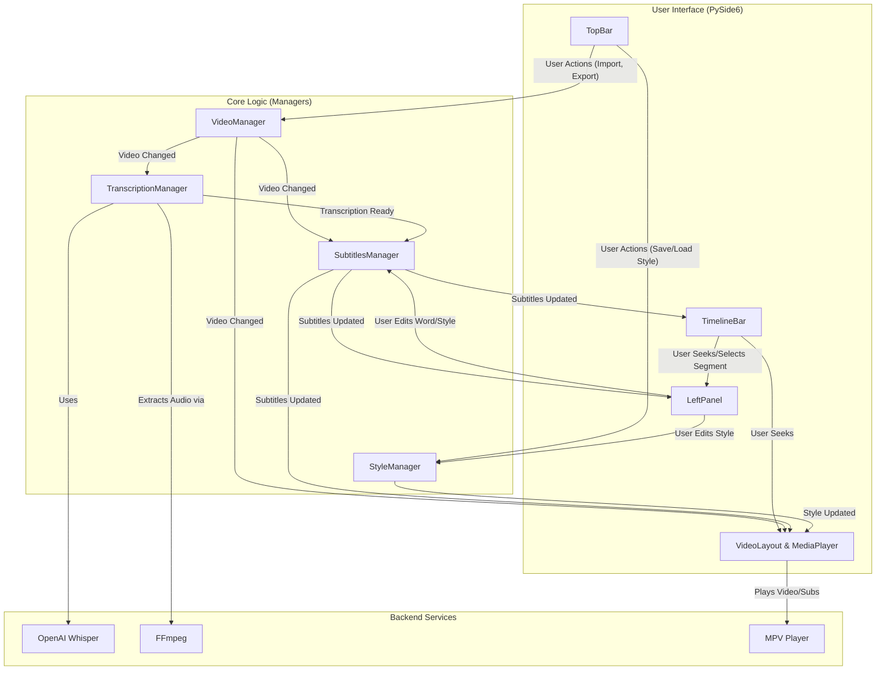

# Auto Subs: Architecture Overview

This document provides a high-level overview of the technical architecture of the Auto Subs application. Its purpose is to help developers and contributors understand the system's design, its core components, and the rationale behind key technical decisions.

## 1. High-Level Overview

Auto Subs is a desktop application built with Python and PySide6. Its architecture can be described as **Manager-based and Event-Driven**.

-   **Manager-based:** The application's state and core business logic are encapsulated within a set of distinct `Manager` classes. Each manager is responsible for a specific domain (e.g., subtitles, styling, video state). This centralizes state and decouples logic from the UI.
-   **Event-Driven:** Components communicate using a **listener (observer) pattern**. When a manager's state changes, it notifies all its registered listeners (typically other managers or UI components), which then react accordingly. This promotes loose coupling and a unidirectional data flow.

Long-running operations, such as AI-powered transcription, are handled asynchronously to ensure the user interface remains responsive at all times.

### System Diagram

## 2. Component Breakdown

### Managers (`src/managers/`)

Managers are the brain of the application. They hold state and implement business logic, but they have no direct knowledge of the UI widgets.

-   **`VideoManager`**: Manages the currently loaded video file. Its sole responsibility is to hold the video path and its duration. It notifies listeners when a new video is imported.
-   **`TranscriptionManager`**: Handles the entire speech-to-text process. It loads the Whisper model in a background thread on startup and exposes an `async` method to transcribe an audio file. When transcription is complete, it notifies its listeners with the raw result.
-   **`SubtitlesManager`**: Acts as the central store for subtitle data. It listens to the `TranscriptionManager` and processes the raw transcription into structured `Subtitles` models. It provides methods to manipulate this data (edit, delete, merge segments/words) and notifies the UI layer whenever the subtitles change.
-   **`StyleManager`**: Manages the visual styling of subtitles. It holds the current style properties (font, color, size, etc.), handles saving/loading style presets, and notifies listeners when the style is modified so the video preview can be updated.

### UI Layer (`src/ui/`)

The UI is built with PySide6 (Qt) and is responsible for presentation and user interaction. It is designed to be a "dumb" layer that primarily reacts to events from the managers.

-   **`SubtitleEditorApp`**: The main application widget that initializes all managers and UI components and wires them together.
-   **`TopBar`**: Contains the main menus ("File", "Style") for high-level actions like importing a video or exporting subtitles.
-   **`LeftPanel`**: A dynamic context-aware panel. It switches between the `StyleLayout` for editing global subtitle styles and the `SegmentWordEditor` for editing the words of a single, selected subtitle segment.
-   **`VideoLayout`**: Contains the `MediaPlayer` widget. It listens for changes from the `SubtitlesManager` and `StyleManager`, generates a temporary `.ass` subtitle file on the fly, and instructs the media player to display it over the video.
-   **`TimelineBar`**: A custom `QGraphicsView`-based widget that provides a visual representation of the video's duration and all subtitle segments. It captures user clicks for seeking and segment selection.

### Data Models (`src/subtitles/models.py`)

These Pydantic-like Python classes represent the core data structures of the application.

-   **`SubtitleWord`**: The most granular unit, containing the text, start time, and end time of a single word.
-   **`SubtitleSegment`**: A logical grouping of `SubtitleWord` objects that form a single subtitle entry (e.g., a sentence). Its own start/end times are derived from its words.
-   **`Subtitles`**: The top-level container that holds a list of `SubtitleSegment`s for the entire video. It includes a class method to be constructed directly from a Whisper transcription result.

### Asynchronous Operations

To prevent the UI from freezing during long operations, the application heavily relies on concurrency.

-   **`threading`**: Used in `TranscriptionManager` specifically to load the large Whisper model on a background thread during application startup. An `threading.Event` is used to signal that the model is ready.
-   **`asyncio` & `qasync`**: `qasync` integrates the `asyncio` event loop with the Qt event loop. This is the primary mechanism for handling asynchronous tasks like file I/O (exporting) and running transcription. It allows us to use `async/await` syntax and `asyncio.create_task` to run work in the background without blocking the UI.

## 3. Key Design Decisions

1.  **Why `mpv` for the video preview?**
    -   **Powerful API:** The `python-mpv` library provides excellent, stable Python bindings for controlling playback, including loading files, seeking, and managing subtitle tracks.
    -   **High-Quality Subtitle Rendering:** `mpv` has native, high-performance support for the Advanced SubStation Alpha (`.ass`) format, which is essential for accurately previewing the complex styles configured in the app.
    -   **Embeddable:** It can be embedded directly into a Qt widget using its window ID (`wid`), providing a seamless user experience.
    -   **Cross-Platform:** It is lightweight and works reliably across Windows, macOS, and Linux.

2.  **Why `QGraphicsView` for the timeline?**
    -   **Scalability & Performance:** The `QGraphicsView` framework is highly optimized for rendering and managing thousands of 2D graphical items (`QGraphicsItem`). This is critical for maintaining a smooth experience, even with very long videos and numerous subtitle segments.
    -   **Abstraction:** It separates the "scene" (the logical content) from the "view" (how it's displayed), which simplifies the implementation of features like panning and zooming (a future goal).
    -   **Interactivity:** It has built-in support for handling mouse events, item selection, and focus, which made implementing segment clicking, multi-selection, and context menus straightforward.

## 4. Data Flow Example: Importing and Transcribing a Video

1.  **User Action:** User clicks `File -> Import MP4` in the `TopBar`.
2.  **Manager Call:** `TopBar` calls `video_manager.set_video_path()`.
3.  **Notification (Video Changed):** `VideoManager` updates its state and notifies all listeners.
4.  **Reaction (Transcription):** `TranscriptionManager` receives the notification, clears any old tasks, and launches a new `asyncio` task to run `whisper.transcribe()`.
5.  **Reaction (Subtitles):** `SubtitlesManager` receives the notification and clears its current subtitle data.
6.  **Reaction (UI):** The `TimelineBar` and `VideoLayout` clear their old state. The `MediaPlayer` loads the new video. The UI is now reset and waiting.
7.  **Asynchronous Work:** The transcription task runs in the background. This may take several minutes.
8.  **Notification (Transcription Ready):** When done, `TranscriptionManager` notifies its listeners with the raw transcription data.
9.  **Reaction (Subtitles):** `SubtitlesManager` receives the data, processes it into `Subtitles` model objects, and notifies its own listeners that new subtitles are available.
10. **Final UI Update:** The `TimelineBar` draws the new subtitle segments, and the `VideoLayout` generates an `.ass` file and passes it to the `MediaPlayer` for preview. The application is now fully updated with the new content.